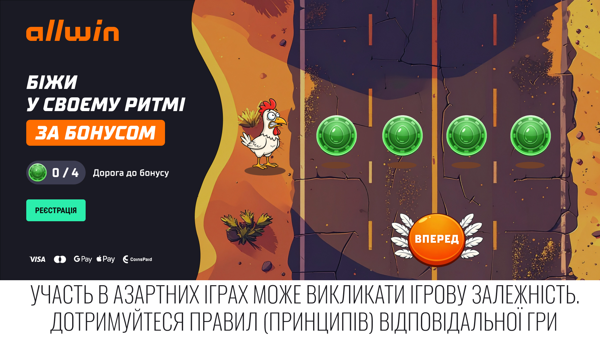

---

## Chicken Canvas — стани елементів і флоу

Canvas-анімація з персонажем (char), монетами (coins), бар'єрами (barriers) та машинами (cars). Логіка в `chicken-canvas.js`, `chicken-canvas-utils.js`. Конфіг — `animations.config.js`. Умови роботи — `front/canvas-flow.md`. Детальний опис полів конфігу — нижче в розділі «Конфіг анімацій».

### Порядок малювання

Background → Coins → Cars → Barriers → Char

---

### Char (персонаж)

| Стан      | Опис                                                                 |
|-----------|----------------------------------------------------------------------|
| `stay`    | Статичний кадр (frame 1). Відображається завжди, коли не jumping.     |
| `jumping` | Циклічна анімація frame 1…10. Char летить по дузі до коіна.         |

**Переходи:**
- `stay` → `jumping`: `startJumpToCoin(index)` — запуск ланцюга або окремий стрибок.
- `jumping` → `stay`: коли char досягає цільового коіна (progress >= 1), викликається `setCoinFadeOut(coinIndex)` і `setCharState('stay')`.

**Позиціонування:** по вертикалі — центр `.land__canvas`; по горизонталі — `offsetX` від лівого краю (breakpoints). Під час jumping позиція інтерполюється по дузі.

---

### Coins (монети)

| Стан      | visible | Опис                                                                 |
|-----------|---------|----------------------------------------------------------------------|
| `static`  | true    | Кадр static.png з папки coin. Монета видима.                        |
| `fade-out`| true    | Анімація зникнення — цикл по frame-1, frame-2, … Після останнього кадру монета зникає. |
| `static`  | false   | Після fade-out. Монета не малюється.                                |

**Переходи:**
- `static` + visible → `fade-out`: `setCoinFadeOut(coinIndex)` — коли char досягає коіна.
- `fade-out` → `static` + visible=false: коли `coin.frameIndex >= frames.length` — монета прибирається, запускається barrier fade-in і car fade-in для цього слоту.

**Позиціонування:** в ряд праворуч від char. Перший — `offsetRight` px; далі — `gapBetween` або `itemGaps` по breakpoints.

---

### Barrier (бар'єр)

| Стан     | visible | Опис                                                                 |
|----------|---------|----------------------------------------------------------------------|
| `hide`   | false   | Не видимий. Бар'єр над coin[i] ще не активний.                      |
| `fade-in`| true    | Анімація появи — цикл по frame 1…6.                                 |
| `static` | true    | Статичний кадр (frame 6). Бар'єр залишається на місці.              |

**Переходи:**
- `hide` → `fade-in`: коли coin[i] завершує fade-out — barrier[i] стає видимим і починає fade-in.
- `fade-in` → `static`: коли `barrier.frameIndex >= frames.length`.

**Позиціонування:** barrier[i] центрується над coin[i], з `offsetAbove` над монетою (breakpoints).

---

### Cars (машини)

| Тип     | Опис                                                                 |
|---------|----------------------------------------------------------------------|
| running | Їде зверху вниз по vertical. Вибір car-1 або car-2 — випадково при кожному старті. |
| fade-in | З'являється зверху, їде до barrier і зупиняється за 20px до нього.   |

**Умови спавну running:**
- Coin у стані `static` і visible (char ще не досяг).
- Немає running машини на цьому coin slot.
- Немає fade-in машини на цьому slot.
- `pendingJumpStart === false`.
- max 2 running машини глобально, min 1 с між стартами на slot.

**Умови спавну fade-in:**
- Коли coin[i] завершує fade-out — автоматично викликається `triggerCarFadeIn(coinIndex)`.
- Якщо chainActive і chainFadeInCombo — тільки для слотів з `chainFadeInCombo.has(coinIndex)` (2–3 машини з 4, комбінації типу [0,1], [1,2], [0,1,3] тощо).
- Max 1 fade-in машина на slot.

**Перед jumping:**
- Якщо є running машини — встановлюється `pendingJumpStart`, нові running не стартують.
- Коли всі running закінчують — `startJumpToCoin(0)`.

**Перед стрибком на коін N:**
- Якщо для slot N є running машина — чекати її проїзду (`pendingJumpForCoinIndex = N`).
- Для slot N не спавнити нові running (перевірка в `startCarRunning`).
- Коли машина проїде — запустити `startJumpToCoin(N)`.

**Під час jumping:** running машини прискорюються (множник з конфігу).

---

### Загальний флоу

```
Клік на [data-canvas-init] (main.js)
    → handleInitClick() → startAnimationChain()
        → chainActive = true
        → якщо runningCars.length > 0: pendingJumpStart = true
        → інакше: startJumpToCoin(0)

startJumpToCoin(0)
    → char: stay → jumping
    → char летить по дузі до coin[0]

Char досягає coin[0] (progress >= 1)
    → setCoinFadeOut(0)
    → setCharState('stay')
    → coin[0]: static → fade-out

coinFadeLoop: coin[0] завершив fade-out
    → coin[0].visible = false
    → barrier[0]: hide → fade-in
    → triggerCarFadeIn(0)
    → якщо chainActive: scheduleNextChainJump(0) → startJumpToCoin(1)

barrierFadeInLoop: barrier[0] завершив fade-in
    → barrier[0]: fade-in → static

runCarFadeInLoop: fade-in машина доїхала до targetY
    → car.moving = false, залишається на місці
```

---

### API

| Метод                 | Опис                                                                 |
|-----------------------|----------------------------------------------------------------------|
| `recalcAndRestart()`  | Перерахунок розмірів canvas, перезавантаження ресурсів, перезапуск анімацій. |
| `handleInitClick()`   | Обробник кліку — викликає startAnimationChain, додає _disabled на кнопку.  |
| `setCharState(state)` | Встановити char: 'stay' | 'jumping'.                              |
| `setCoinFadeOut(i)`   | Запустити fade-out для coin[i].                                      |
| `startAnimationChain()`| Запустити ланцюг стрибків char по коінах.                           |

---

## Конфіг анімацій (animations.config.js)

**Файл:** `front/js/animations/config/animations.config.js`

**Експорти:** `chickenCanvasConfig` (передається в `initChickenCanvas` з [main.js](front/js/main.js)), `textAnimationConfig` (використовується в [utils.js](front/js/utils.js) для текстової анімації).

### chickenCanvasConfig — детальний опис полів

#### selectors

Селектори DOM-елементів для канвасу та кнопки запуску.

| Поле | Тип | Призначення |
|------|-----|-------------|
| `wrapper` | `string` | Контейнер канвасу (наприклад `.land__canvas`). Використовується для отримання розмірів при `isWrapperFill: true` і для розміщення canvas. |
| `landLeft` | `string` | Блок лівої колонки (текст, кнопка). Може використовуватись для розміток або скролу. |
| `canvas` | `string` | Елемент `<canvas>` (наприклад `[data-canvas="chicken"]`). На ньому малюється фон, коіни, машини, бар'єри, char. |
| `initBtn` | `string` | Кнопка запуску анімації (наприклад `[data-canvas-init="chicken"]`). Клік викликає `handleInitClick`. |
| `initBtnDisabledClass` | `string` | CSS-клас стану «вимкнено» для кнопки (наприклад `_disabled`). Додається після старту ланцюга, знімається при `recalcAndRestart`. |
| `counterNumber` | `string` | Елемент, у якому показується лічильник зібраних монет у форматі «N / total» (наприклад `.land__counter-number`). |

#### backgroundBreakpoints

Вибір фонового зображення за шириною канвасу та опційно орієнтацією екрану.

| Поле в елементі | Тип | Призначення |
|-----------------|-----|-------------|
| `rootWidth` | `number` | Поріг ширини канвасу (px). Breakpoints сортуються за `rootWidth` за спаданням. Вибір: перший елемент, для якого `canvasWidth >= rootWidth + switchThreshold`. |
| `rootHeight` | `number` | Опорна висота (px); може використовуватись для пропорцій або майбутньої логіки. |
| `src` | `string` | Шлях до зображення фону (наприклад `./img/canvas/bg.jpg`). |
| `orientation` | `'portrait' \| 'landscape'` | Опційно. Якщо вказано — цей breakpoint застосовується тільки при відповідній орієнтації екрану (`matchMedia('(orientation: portrait)')`). |

Перед вибором breakpoint масив фільтрується по `orientation`; якщо після фільтрації нічого не залишилось — використовується повний масив.

#### switchThreshold

| Тип | Призначення |
|-----|-------------|
| `number` | Поріг у пікселях для перемикання фону. Умова переключення: `canvasWidth >= rootWidth + switchThreshold`. Типово 50. |

#### canvasBreakpoints

Розмір canvas за шириною viewport. Масив сортований за `maxWidth` по зростанню; застосовується перший елемент, де `viewportWidth <= maxWidth`.

| Поле в елементі | Тип | Призначення |
|-----------------|-----|-------------|
| `maxWidth` | `number` | Максимальна ширина viewport (px), при якій діє цей breakpoint. Може бути `Infinity` для «все решта». |
| `width` | `number` | Ширина canvas у пікселях. |
| `height` | `number` | Висота canvas у пікселях. |
| `isWrapperFill` | `boolean` | Опційно. Якщо `true` — ширина і висота canvas беруться з розмірів елемента `wrapper` (`.land__canvas`), а не з `width`/`height`. |
| `orientation` | `'portrait' \| 'landscape'` | Опційно. Якщо вказано — breakpoint застосовується тільки при відповідній орієнтації екрану. |

Алгоритм вибору: спочатку масив `canvasBreakpoints` фільтрується за `orientation` (якщо є такі поля), потім із відфільтрованих елементів обирається перший, де `viewportWidth <= maxWidth`. Якщо після фільтрації нічого не залишилось — використовується початковий масив без фільтрації за орієнтацією.

---

#### char (персонаж)

Конфіг персонажа: стани `stay` | `jumping`, розміри та позиція по breakpoints.

| Поле | Тип | Призначення |
|------|-----|-------------|
| `defaultState` | `'stay' \| 'jumping'` | Початковий стан при ініціалізації та після `recalcAndRestart`. |
| `width` | `number` | Базова ширина персонажа (px); фактичні розміри беруться з `sizeBreakpoints`. |
| `height` | `number` | Базова висота (px); так само перевизначається через `sizeBreakpoints`. |
| `sizeBreakpoints` | `Array<{ maxWidth, width, height }>` | Розміри char по viewport. Перший елемент, де `viewportWidth <= maxWidth`. Без breakpoint використовуються базові `width`/`height`. |
| `jumpFrameDelay` | `number` | Затримка (ms) між кадрами анімації під час стрибка (`jumping`). |
| `frames` | `string[]` | Масив шляхів до кадрів (PNG). Індекс 0 — stay; 1…N — цикл jumping. |
| `breakpoints` | `Array<{ maxWidth, offsetX?, centerY? }>` | Позиція char по горизонталі. `offsetX` — відступ від лівого краю canvas (px). `centerY` (опційно) — центрування по вертикалі. |

---

#### coins (монети)

Конфіг монет у ряд праворуч від char. Стани: `static` (видима) → `fade-out` (анімація зникнення) → прихована.

| Поле | Тип | Призначення |
|------|-----|-------------|
| `defaultState` | `string` | Початковий стан кожної монети (наприклад `'static'`). |
| `width` | `number` | Базова ширина монети (px). Перевизначається через `breakpoints` (sizeBreakpoints). |
| `height` | `number` | Базова висота (px). |
| `breakpoints` | `Array<{ maxWidth, orientation?, width?, height?, offsetRight?, gapBetween?, itemGaps? }>` | Єдиний масив брейкпоінтів: розміри, відступ від char (`offsetRight`), проміжки між монетами (`gapBetween`), кастомні проміжки (`itemGaps: { [index]: { gapBetweenLeft?, gapBetweenRight? } }`). Перший де `viewportWidth <= maxWidth` і `orientation` збігається (CSS-like). |
| `imagePath` | `string` | Базова папка з зображеннями монет. |
| `staticFrame` | `string` | Шлях до кадру статичної монети (до початку fade-out). |
| `frames` | `string[]` | Шляхи кадрів анімації fade-out (зникнення). |
| `offsetRightDefault` | `number` | Відстань (px) від правого краю char до першої монети — fallback якщо `offsetRight` не вказано в жодному breakpoint. |
| `fadeFrameDelay` | `number` | Затримка (ms) між кадрами анімації fade-out. |
| `items` | `Array<{ id, gapBetweenLeft?, gapBetweenRight? }>` | Список монет: `id` — індекс; опційно `gapBetweenLeft`/`gapBetweenRight` як fallback, якщо нема в `itemGaps`. |

---

#### barrier (бар'єри)

Бар'єр над кожною монетою. Стани: `hide` → `fade-in` → `static`.

| Поле | Тип | Призначення |
|------|-----|-------------|
| `defaultState` | `string` | Початковий стан (наприклад `'hide'`). |
| `width` | `number` | Базова ширина бар'єра (px). Перевизначається в `breakpoints`. |
| `height` | `number` | Базова висота (px). |
| `breakpoints` | `Array<{ maxWidth, width?, height?, offsetAbove? }>` | Розміри та опційно `offsetAbove` по viewport. |
| `imagePath` | `string` | Папка з кадрами бар'єра. |
| `frames` | `string[]` | Шляхи кадрів анімації fade-in (з'явлення). |
| `staticFrameIndex` | `number` | Індекс кадру після fade-in (статичний вигляд бар'єра). |
| `offsetAboveDefault` | `number` | Відстань (px) від верхнього краю монети до бар'єра, якщо не задано в breakpoints. |
| `offsetAboveBreakpoints` | `Array<{ maxWidth, offsetAbove }>` | Відстань «над монетою» по viewport (px). |
| `fadeInFrameDelay` | `number` | Затримка (ms) між кадрами fade-in. |
| `items` | `Array<{ id }>` | Список бар'єрів (один бар'єр на монету за індексом `id`). |

---

#### cars (машини)

Машини двох типів: running (їдуть зверху вниз) і fade-in (з'являються після збору монети і їдуть до бар'єра).

| Поле | Тип | Призначення |
|------|-----|-------------|
| `variants` | `Array<{ width, height, src }>` | Варіанти зовнішнього вигляду: розміри (px) та шлях до зображення. При спавні вибирається випадковий варіант. |
| `breakpoints` | `Array<{ maxWidth, sizeScale?, offsetAboveCanvas?, stopBeforeBarrier? }>` | По viewport: `sizeScale` — множник розміру (наприклад 0.75 для зменшення на 25%); `offsetAboveCanvas` — відступ від верхнього краю canvas; `stopBeforeBarrier` — відстань (px) до бар'єра, на якій машина зупиняється у стані fade-in. |
| `offsetAboveCanvas` | `number` | Дефолтний відступ від верху canvas (px), якщо не перевизначено в breakpoints. |
| `runningIntervalMin` | `number` | Мінімальний інтервал (с) між запусками running-машин на одному слоті. |
| `runningIntervalMax` | `number` | Максимальний інтервал (с) між запусками running-машин. |
| `runningSpeed` | `number` | Швидкість руху running-машини (px за одиницю часу). |
| `minStartGap` | `number` | Мінімальний проміжок (в одиницях логіки) між стартами running на одному слоті. |
| `maxConcurrent` | `number` | Максимальна кількість одночасно їдучих running-машин на всьому канвасі. |
| `stopBeforeBarrier` | `number` | Дефолтна відстань (px) до бар'єра для зупинки fade-in машини. |
| `fadeInSpeed` | `number` | Швидкість руху fade-in машини (px за одиницю часу). |
| `runningSpeedMultiplierDuringJump` | `number` | Множник швидкості running-машин під час стрибка char (прискорення). |

---

#### animationChain (ланцюг стрибків)

Параметри руху char по дузі та таймінги ланцюга.

| Поле | Тип | Призначення |
|------|-----|-------------|
| `jumpArcHeight` | `number` | Висота дуги стрибка (px) — максимальне підняття над лінією старт–фініш. |
| `jumpDuration` | `number` | Тривалість одного стрибка (ms). |
| `betweenJumpsDelay` | `number` | Затримка (ms) між приземленням на коін і стартом стрибка до наступного коіна. |
| `popupOpenDelayAfterLastJump` | `number` | Затримка (ms) після приземлення на останній коін до виклику `onChainComplete` (скрол, overflow, показ попапу). |

Опційно в коді (наприклад у main.js) до ланцюга підписується `onChainComplete` — callback без аргументів, викликається після затримки `popupOpenDelayAfterLastJump` після останнього стрибка.

#### override

| Тип | Призначення |
|-----|-------------|
| `object \| null` | Для тестів: якщо задано, може підставляти кастомні breakpoints або root для примусового вибору фону. У продакшені зазвичай `null`. |

---

Деталі позиціонування та умов роботи — у [front/canvas-flow.md](front/canvas-flow.md).

### textAnimationConfig — детальний опис полів

Текстова анімація (показ блоків тексту по черзі).

| Поле | Тип | Призначення |
|------|-----|-------------|
| `wrapOrder` | `string[]` | Масив селекторів DOM-елементів у порядку показу (наприклад `['.land__text-item._first', '.land__text-item._second', '.land__text-item._third']`). |
| `beforeShowBottomDelay` | `number` | Затримка (ms) перед показом нижнього (наступного) елемента. |
| `showDuration` | `number` | Тривалість (ms) анімації показу елемента. |

---

## fabric-animation-chaining.js

Система послідовного запуску анімацій через зміну CSS-класів.

### Імпорт

```js
import { initAnimationChaining, toggleAnimation } from './animations/fabric-animation-chaining.js';
```

### initAnimationChaining(config)

Запускає ланцюжок кроків з заданими затримками.

**Конфіг:**

| Поле              | Тип     | Опис                                                    |
|-------------------|---------|---------------------------------------------------------|
| `beforeStartDelay`| `number`| Затримка перед першим кроком (ms). За замовч. `0`      |
| `steps`           | `array` | Масив кроків анімації                                  |
| `delays`          | `array` | Масив затримок між кроками (ms). Індекс відповідає кроку |

**Крок (step):**

| Поле                | Тип         | Опис                                                                 |
|---------------------|-------------|----------------------------------------------------------------------|
| `animation`         | `string`    | Тип анімації. Наразі: `'toggleAnimation'`                            |
| `el`                | `Element`   | DOM-елемент (один)                                                   |
| `elements`          | `Element[]` | Масив елементів (замість `el`)                                       |
| `addClass`          | `string`    | Клас для додавання                                                  |
| `removeClass`       | `string`    | Клас для видалення                                                  |
| `delay`             | `number`    | Затримка перед наступним кроком (опційно, якщо `delays` не вказано) |
| `callback`          | `function`  | Функція після виконання кроку. Аргументи: `(step, index)`           |
| `callbackArgs`      | `array`     | Додаткові аргументи для `callback`                                  |
| `stopAnimationChaining` | `boolean` | Якщо `true`, ланцюжок зупиняється після цього кроку         |

**Приклад:**

```js
initAnimationChaining({
  beforeStartDelay: 500,
  steps: [
    { animation: 'toggleAnimation', el: el1, addClass: '_fade-in', removeClass: '_fade-out', delay: 200 },
    { animation: 'toggleAnimation', el: el2, addClass: '_fade-in', removeClass: '_fade-out', delay: 0, callback: function () { console.log('done'); } },
  ],
  delays: [200, 0],
});
```

**Повертає:** функцію `cancel()` для зупинки ланцюжка.

### toggleAnimation(el, addClass, removeClass)

Допоміжна функція: додає/знімає класи на елементі без запуску ланцюжка.

---

## sky-animation.js

Canvas-анімація парних об’єктів (хмари, монети, купюри) на фоні.

### Імпорт

```js
import { initSky } from './animations/sky-animation.js';
```

### initSky(config)

Створює canvas на елементі `.sky`, підвантажує зображення й запускає анімацію.

**Конфіг:**

| Поле                 | Тип     | Опис                                                      |
|----------------------|---------|-----------------------------------------------------------|
| `selector`           | `string`| Селектор контейнера (напр. `.sky`, `.sky--background`)    |
| `spawnIntervalMs`    | `number`| Інтервал спавну елементів (ms). За замовч. `1000`         |
| `angleMin` / `angleMax` | `number` | Кут обертання елемента (градуси)                      |
| `baseSpeed`          | `number` | Базова швидкість руху                                |
| `elementConfig`      | `array`  | Опис типів елементів: `{ type, className, limit, speed? }` |
| `elementDrawConfig` | `array`  | Опис зображень: `{ type, className, imageSrc, width, height, breakpoints? }` |
| `canvasSizeMultiplier` | `number` | Множник розміру canvas (напр. 1.4 для більшої області) |

**Логіка:**
- Елементи з’являються справа з випадковим кутом і швидкістю.
- Спочатку спавняться хмари (`cloud-penta`, `cloud-row`).
- Обмеження кількості кожного типу задає `limit` в `elementConfig`.
- `breakpoints` у `elementDrawConfig` задають інші розміри для різних ширин екрана.
- Анімація призупиняється при `document.hidden` і відновлюється при поверненні на вкладку.

---

## airplane-fly-animation.js

Анімація польоту літака з димовим слідом.

### Імпорт

```js
import { initAirplaneFly } from './animations/airplane-fly-animation.js';
```

### initAirplaneFly(config)

Повертає об’єкт з методами `start()` та `updateConfig(partial)`.

**Конфіг:**

| Поле                    | Тип     | Опис                                                    |
|-------------------------|---------|---------------------------------------------------------|
| `wrapSelector`           | `string`| Контейнер літака. За замовч. `.airplane-fly-wrap`       |
| `scaleWrapSelector`      | `string`| Елемент для scale. За замовч. `.airplane-fly-scale-wrap` |
| `canvasSelector`         | `string`| Canvas для диму. За замовч. `.airplane__smoke-tail`     |
| `baseFlySpeed`          | `number`| Початкова швидкість (px/s)                             |
| `increaseFlySpeed`      | `number`| Кінцева швидкість після розгону (px/s)                 |
| `speedAccelDuration`    | `number`| Час розгону (ms)                                       |
| `trajectoryAngleDeg`    | `number`| Кут траєкторії в градусах (напр. -10 — вгору вправо)   |
| `changeSizeDelay`       | `number`| Затримка перед scale (ms)                              |
| `scaleToSpeedDelay`     | `number`| Затримка після scale перед розгоном (ms)               |
| `flyScale`              | `number`| Масштаб після scale (напр. 0.8)                        |
| `scaleTransitionDuration` | `number` | Тривалість scale (s)                              |
| `smokeTail`             | `object`| Параметри диму: `particleCount`, `particleSpeed`, `particleSizePercent`, `particleImageSrc`, тощо |

**Приклад:**

```js
const fly = initAirplaneFly({
  baseFlySpeed: 750,
  increaseFlySpeed: 25000,
  trajectoryAngleDeg: -10,
  changeSizeDelay: 500,
  flyScale: 0.8,
});

fly.start();
fly.updateConfig({ trajectoryAngleDeg: -60 });
```

**Поведінка:**
- Літак рухається за `trajectoryAngleDeg`.
- Після `changeSizeDelay` застосовується scale.
- Потім відбувається розгон до `increaseFlySpeed`.
- Димовий слід рендериться на окремому canvas.
- Після повного виходу за межі екрана анімація зупиняється.

---

## test.js

Модуль тестових кнопок для відладки анімацій. Використовується лише при `debug: true` в `main.js`.

**Що робить:**
- Додає блок `.menu-test` з кнопкою «Menu» і набором тестових кнопок.
- Кнопка «Menu» перемикає показ/приховування інших кнопок.
- Список кнопок задається масивом `testButtons`: кожен елемент містить `className`, `label`, `onClick`.

**Додавання нової кнопки:** додати об’єкт до `testButtons`:

```js
{ className: 'js-menu-test-my', label: 'Мій тест', onClick: function () { /* ... */ } },
```

Функція `initTest(root, getFadeOutPopupConfig, getPopupCloseConfig, getPopupOpenChunkConfig)` викликається з `main.js`, їй передається root-елемент (`.land`) та потрібні конфіги.
